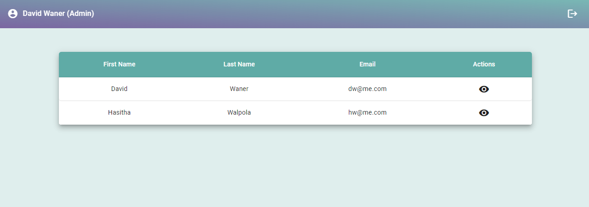

# VTAI Todo App Frontend

[Deployed Application](https://vtai-todo.uc.r.appspot.com)

This README outlines the steps to setup the project, provides a brief description of the application and its design, highlights the important design and implementation decisions taken.

## Content

- [VTAI Todo App Frontend](#vtai-todo-app-frontend)
  - [Content](#content)
  - [Setting Up](#setting-up)
    - [Install](#install)
    - [Run](#run)
    - [Run the unit tests](#run-the-unit-tests)
  - [Build](#build)
  - [The Application](#the-application)
    - [Design](#design)
      - [Auth](#auth)
      - [Normal User](#normal-user)
      - [Admin User](#admin-user)
    - [Implementation](#implementation)
      - [Auth](#auth-1)
      - [Normal User](#normal-user-1)
      - [Admin User](#admin-user-1)
  - [Important Decisions](#important-decisions)
    - [Architectural Decisions](#architectural-decisions)
    - [Implementation Decisions](#implementation-decisions)
  - [Checklist](#checklist)
    - [✅ Unit Tests](#-unit-tests)
    - [✅ Deployemnt](#-deployemnt)

## Setting Up

The following steps are necessary to set up the project in the development environment:

### Install

Install dependencies by running the following command in the root of the project:

```bash
# From root of the project.
yarn install or npm install
```
### Run

Run the following command to start the Websocket server and the front-end application.

```bash
# From root of the project.
npm start or ng serve
```
Navigate to `http://localhost:4200/`. The application will automatically reload if you change any of the source files.

### Run the unit tests

To run the unit test suite, execute the following command:

```bash
# From root of the project.
ng test
```
## Build

Run `ng build` to build the project. The build artifacts will be stored in the `dist/` directory.

## The Application

The application consists of two flows: the admin user flow and the normal user flow.

### Design

The design process started with creating a wireframe for each page to have a better visual understanding of the application.


#### Auth

Login and Signup screeens.


#### Normal User

This todo list page displayed when the user logged as normal user.


#### Admin User

This user list page displayed when the user logged as admin user and can view the user translation history.


### Implementation

The low-fidelity design was used as a starting point for the implementation, skipping the high-fidelity design phase due to time constraints.

#### Auth

Implementation of the auth pages:


#### Normal User

Implementation of the normal user flow:


#### Admin User

Implementation of the normal user flow:




## Important Decisions

The following implementation, and architectural decisions were taken throughout the development process:

### Architectural Decisions


  Following is the basic structure of the repo.

  - `apps`
    - `src`
  - `packages`
    - `eslint-plugin`
  - `store`
    - `ngrx` (Used for translation button)

- Typescript was the primary language used for development.
- Google Translation API used for translations

### Implementation Decisions

- Angular was used for the implementation of the frontend with Angular Material.


## Checklist

This section provides a summary of my adherence to the requirements listed.

### ✅ Unit Tests

- Implemented with Jasmine.
- To run tests: `ng test` from project root
- Coverage:

  

### ✅ Deployemnt

[Deployement Document]("docs/resources/VTAI%20-%20Todo%20App%20Deployment.pdf")

- Application deployed to the Google Cloud using Github Cloud Builder
- Application deployed automatically when push to main branch(CI/CD)
